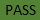
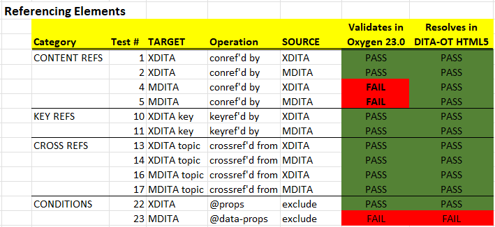
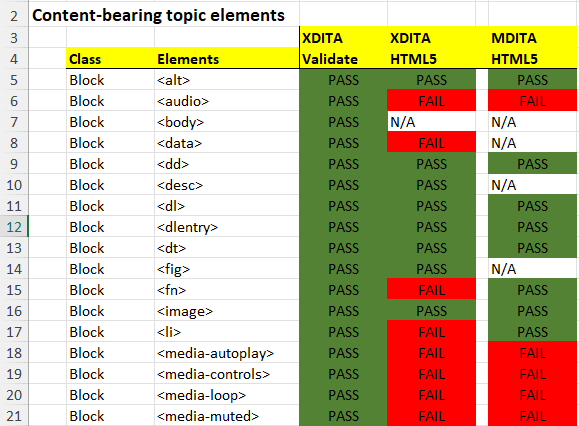
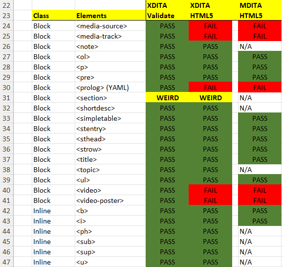
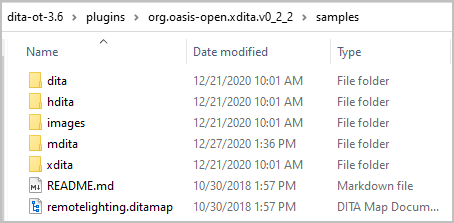
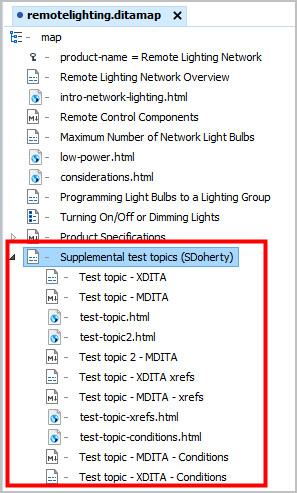
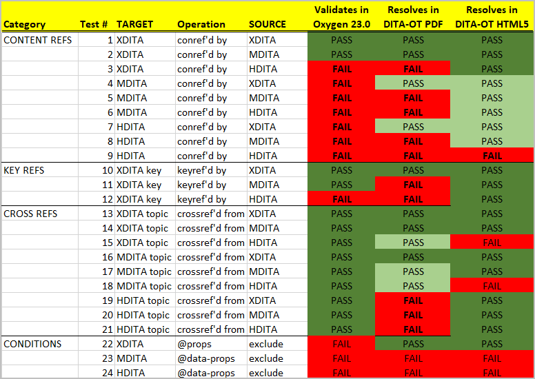

# Lightweight DITA Testing

This repo provides source files for ongoing LwDITA pilot testing. If you have an interest in LwDITA -- and I hope that you do -- see [Lightweight DITA: An Introduction Version 1.0](http://docs.oasis-open.org/dita/LwDITA/v1.0/cn02/LwDITA-v1.0-cn02.pdf) produced by the [OASIS DITA Lightweight Subcommittee](https://www.oasis-open.org/committees/tc_home.php?wg_abbrev=dita-lightweight-dita). It provides an overview of the evolving specification and many wonderful examples.

There are two major sections in this page:

1. April 2022 test results
2. February 2021 test results

# April 2022 test results

## 2022 Test files

I updated the February 2021 test files when necessary. Otherwise I added two test files full of block and inline elements:

* ```xdita/element-gallery1.dita```
* ```mdita/element-gallery1.md```

## 2022 Test environment 

I updated the test environment.

* Oxygen Editor 24.1  
* DITA-OT 3.7.1 HTML5 transform
* Windows 11 and MacOS 12 (Monterey)

## 2022 Test notes

I documented the input and the results of 24 tests in the file [LwDITA_test-notes_April-2022.txt](LwDITA_test-notes_April-2022.txt). Each test gets a PASS or FAIL relative to its successful resolution in Oxygen (for validation) and DITA-OT  HTML5 output.   

## Test results

Here's the legend for the following tables. 

: The test encountered validation and/or processing error(s) 

: The test "validated" and produced expected output on the first try.   
 
### April 2022 referencing elements



### April 2022 block and inline topic elements





# February 2021 test results 

## Test files

The majority of test files here are derived directly from the Lightweight DITA sample files currently shipping with the DITA-OT. 



Where those sample files lacked an example of a cross-format transclude, cross-ref, keyref, or condition, I supplemented the DITA-OT sample files with a supplemental file.   



Yes -- we should expect that XDITA maps and topics will interoperate as well as their kissin' cousins in DITA 1.3. Not that interesting. But -- how well do MDITA (Markdown) and HDITA (HTML5) files handle transcludes, cross-references, key resolutions, and conditional processing? Can I build a reuse library in MDITA and expect XDITA and HDITA to be able to transclude "elements" in there? In short, what should be my level of investment in MDITA and HDITA relative to XDITA or DITA 1.3? 

## Test environment 

My test environment represents a personal best-guess about the tools that pilot writers may use to develop and build their pilot sources:

* Oxygen Editor 23.0  
* DITA-OT 3.6 HTML5 transform
* DITA-OT 3.6 PDF transform
* Windows 10 and MacOS High Sierra

## Test notes

I documented the input and the results of 24 tests in the file [LwDITA_test-notes_February-2021.txt](LwDITA_test-notes_February-2021.txt). Each test gets a PASS or FAIL relative to its successful resolution in Oxygen, HTML5, and PDF. Hopefully the breadth of testing will give potential LwDITA pilot participants some sense of where to invest their time.  

## Test results

When I first ran my tests in late-December/early-January, I encountered numerous issues. Carlos Evia kindly reviewed my tests and noted that I had several errors in the @format attributes of the topics that I had added to the rootmap. Doah! I made those corrections, ran the tests again, and noted the improvements.

Here's the legend for the following table. 

: The test encountered validation and/or processing error(s) 

: The test "validated" and produced expected output on the first try.   
 
: The test "validated" and produced expected output on the second try (mea culpa).  



## Concluding notes

Lightweight DITA is an exciting development for organizations working in DITA 1.3, especially those organizations being asked to collaborate with writers working in Markdown and/or HTML5.

I will continue to update these sources as I discover other errors that I may have made or improved LwDITA support in the tool chain. I have been around too long to assume that I have it all together, so - **PLEASE** - clone this repo, find my errors, and make improvements in your test suite.   

I am moving on to write a tech paper for the OASIS DITA Adoption Technical Committee called *Planning a Lightweight DITA Pilot*. If you are interested in getting involved with the [DITA Adoption Technical Committee](https://www.oasis-open.org/committees/tc_home.php?wg_abbrev=dita-adoption), please get in touch.  

Stanley Doherty, Ph.D.

stan@modularwriting.com

StanDoherty@google.com

   