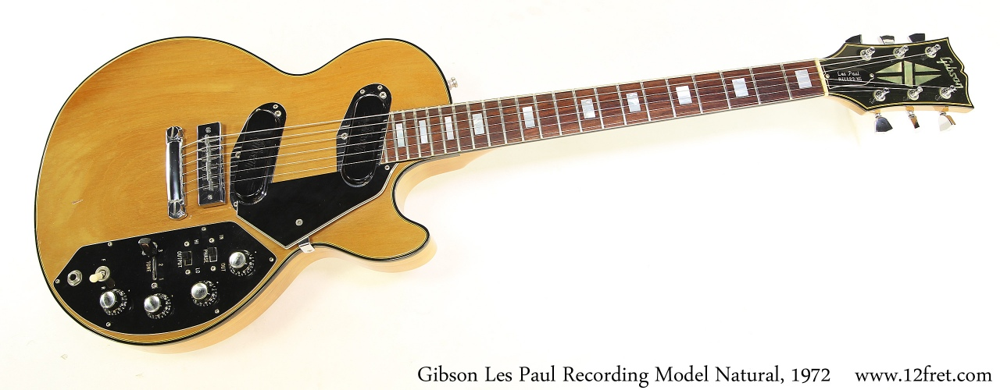

# MDITA elements

First paragraph = shortdesc shortdesc shortdesc shortdesc  

Second paragraph with inline formatting for **bold**, *italics*, <sub>subscript</sub>, and <sup>superscript</sup)>.

## Level 2 head 

Running text and an inline image (Gibson logo)  and more running text.



Paragraph with a footnote reference.[^1]

[^1]: And here's the footnote text.

Note content (not semantic).

Apple
:   Pomaceous fruit of plants of the genus Malus in 
the family Rosaceae. text text text text text text text text text text text text text text 

Orange
:   The fruit of an evergreen tree of the genus Citrus. text text text text text text text text text 


Paragraph

1. Ordered list item
2. Ordered list item
3. Ordered list item
4. Ordered list item
5. Ordered list item

 * Unordered list item
 * Unordered list item

Paragraph
 
<video src="../media/sample.mp4" controls poster="../media/preview.png"></video>

<audio src="../media/sample.mp3"></audio>

<table>
  <thead>
    <tr>
      <th>head-col1</th>
      <th>head-col2</th>
     </tr>
  </thead>
  <tbody>
    <tr>
      <td>row1-col1</td>
      <td>row2-col1</td>
    </tr>
    <tr>
      <td>row1-col2</td>
      <td>row2-col2</td>
    </tr>
  </tbody>
</table>

Text with inline code ```code``` and more text.

Code block next 

    Line break
      Line break
        Line break

